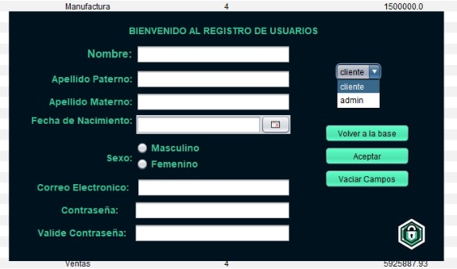

# Proyecto-Empresa
Creacion de un login para una empresa con bases de datos

Instalacion en Neatbeans
-------------------------
Descomprime los zips "ProyectoFinalEMPRESA" y "BaseDeDatosMySQL"

**Uso**
------------------------
- **ANTES DE EJECUTAR EL CODIGO DEBERAS HACER CLICK EN CLEAN AND BUILD PARA QUE EL PROGRAMA FUNCIONE SIN FALLAS**
- Para entrar a la base de datos deberas escribir los correos definidos por default:

- **IMPORTANTE** Correo: edmen1847@gmail.com & Contraseña: Nolapierdas3  (**CORREO COMO ADMINISTRADOR**)
- **IMPORTANTE** Correo: edmen415@gmail.com & Contraseña: Nolapierdas1   (**CORREO COMO CLIENTE**)
- 
  
- Si entras como administrador, puedes crear un usuario nuevo, ya sea administrador o cliente
- 
- Te recomendamos crear un nuevo administrador con tu correo electronico, para que puedas probar la funcion de "recuperar contraseña"
 a tu correo

- El programa tiene cierta permanencia de usuarios asi que no habra problema si cierras el programa y lo abres de nuevo con algun usuario recien registrado

**FUNCIONES**
------------------------
- **Cuenta con cuadros de busqueda por acta y nombres**
- 
- **Campos editables con el click derecho (solo como administrador)**
- 
- **Eliminacion de registros (Solo como administrador)**
- **Creacion de registros (Solo como administrador)**
- **Campo para recuperar el usuario y contraseña**
- **Campo para escribir codigo de verificacion y cambiar de contraseña**

**Creado por:**
------------------------------
- Leyva Solis Kaleb Daniel
- Mendoza Martinez Eduardo Yael

**VIDEO DEMOSTRACION**
--------------------------------
https://youtu.be/wl_8z8YxDbY?si=cqsGhE5w4jchqE_B
